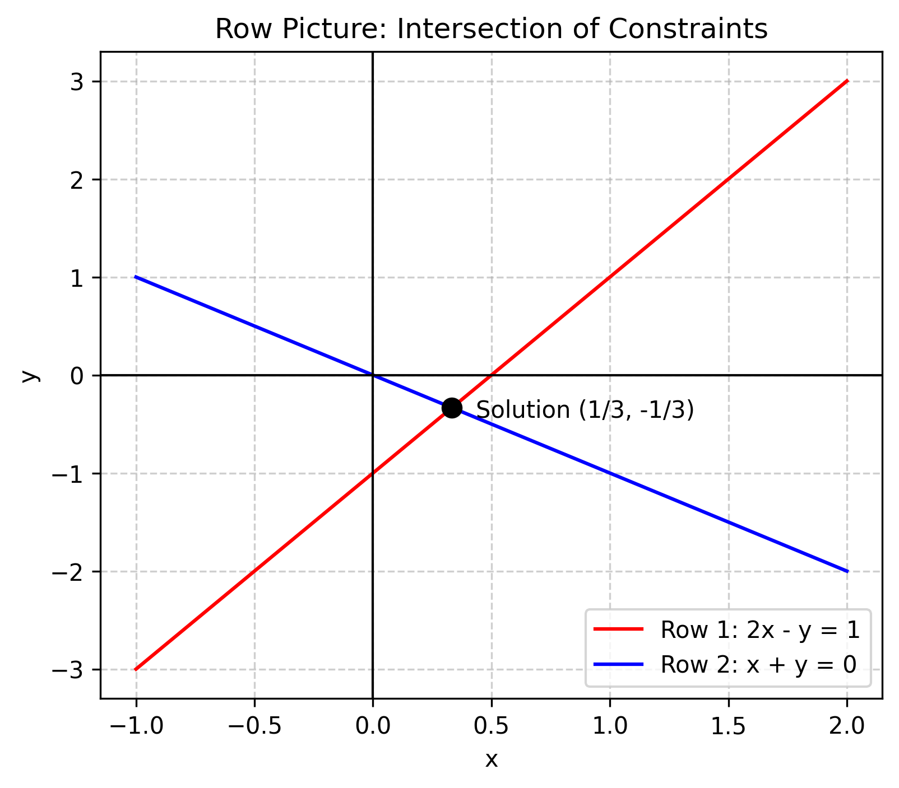
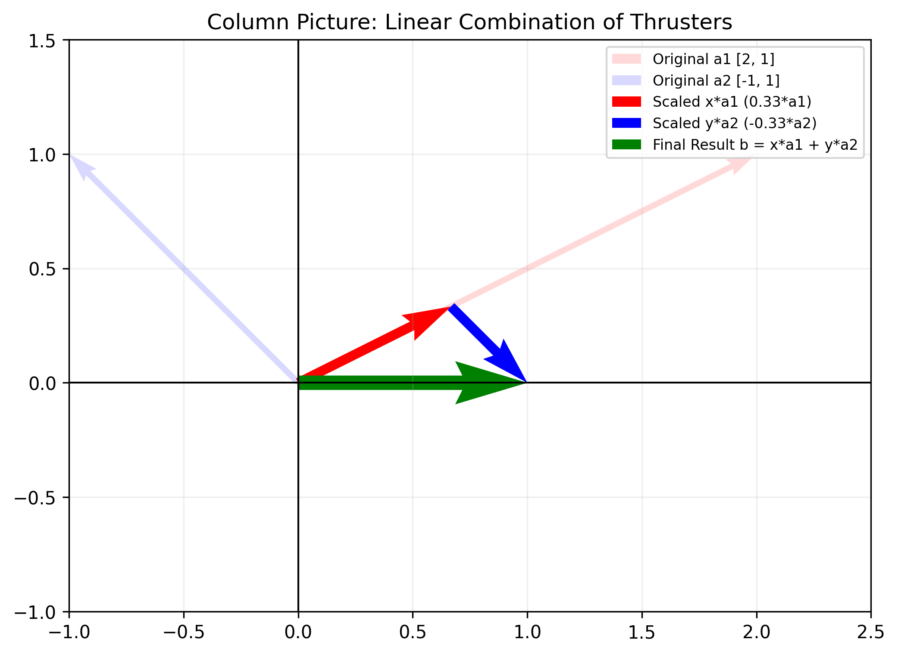

# Day 01: The Geometry of Linear Equations

## 1. The Core Problem
**Q. How do we combine individual thruster outputs to achieve a desired global motion?**

In mobile robotics, we solve $Ax = b$ to determine how much power (control input $x$) to send to our actuators (thrusters, motors) to achieve a target velocity or force ($b$). Understanding the geometry of this equation is the first step in robot control and state estimation.

## 2. Two Pictures of $Ax = b$

### 2.1 The Row Picture (Intersection of Constraints)
The row picture views the system as a set of geometric constraints. Each row in matrix $A$ represents a line (in 2D) or a plane (in 3D) that the solution $x$ must satisfy.


2x - y = 1 \quad \text{(Constraint 1)}


x + y = 0 \quad \text{(Constraint 2)}


The solution is the unique **intersection point** where all constraints are met simultaneously.




> \vspace{3cm}

### 2.2 The Column Picture (Linear Combination of Actuators)
**This is the fundamental perspective for Robotics.** We interpret the matrix $A$ as a collection of "action vectors" provided by the robot's hardware.


The equation $Ax = b$ is rewritten as finding weights $x$ and $y$ such that:


$$ x \begin{bmatrix} 2 \\ 1 \end{bmatrix} + y \begin{bmatrix} -1 \\ 1 \end{bmatrix} = \begin{bmatrix} 1 \\ 0 \end{bmatrix} $$


The solution ($x=1/3, y=-1/3$) tells us exactly how to command our thrusters to "assemble" the target velocity $b$.



**How to read this figure:**
1.  **Original Columns (Dashed):** The original directions of Thruster 1 ($a_1$, red) and Thruster 2 ($a_2$, blue). Note they point from the origin.
2.  **Scaled Vectors (Solid):** We scale $a_1$ by $x$ (making it short red) and $a_2$ by $y$ (making it short blue, reversing its direction).
3.  **Combination:** We start at the origin, follow the scaled red vector ($x a_1$), and *from its tip*, we follow the scaled blue vector ($y a_2$).
4.  **Result:** The final destination is exactly the target vector $b = [1, 0]^T$ (thick green arrow).

> \vspace{3cm}

---

## 3. Beyond Calculation: Key Robotics Concepts

### 3.1 Linear Combination and the "Span" (Reachability)
The sum $x_1 a_1 + x_2 a_2 + \dots + x_n a_n$ is called a **Linear Combination**. 


- **Column Space:** The set of all possible linear combinations of the columns of $A$.
- **Robotics Insight:** The Column Space represents the **Reachable Workspace** of your robot's forces. If a target motion $b$ lies outside this space (is not in the "Span"), the robot is physically incapable of moving in that direction with the current actuator configuration.

> \vspace{4cm}

### 3.2 Two Interpretations of Matrix Multiplication
When we see $Ax = b$, we can interpret the multiplication in two ways:

1. **Row Interpretation (The "Score" View):**
   Each element $b_i$ is the dot product of the $i$-th row of $A$ and the vector $x$. It measures how much the input $x$ aligns with the $i$-th constraint.
2. **Column Interpretation (The "Assembly" View):**
   The vector $b$ is a weighted sum of the columns of $A$. We "assemble" the final output by taking $x_j$ amount of each column $a_j$. 

**In Robotics, the Column Interpretation is dominant** because we are usually asking: "How do I combine my available actuators to produce this movement?"

> \vspace{4cm}

---

## 4. Quick Quiz
1. **The Reachability Problem:** If a marine robot has two thrusters that both point in the same direction $[1, 0]^T$, describe the resulting Column Space. Can this robot reach a target velocity $b = [0, 1]^T$? Why or why not?
2. **Interpretation Shift:** When a sensor (like a GPS) gives you a measurement $b$, and you try to find the robot's state $x$ using $Ax = b$, are you more likely using the **Row Picture** (checking constraints) or the **Column Picture** (combining actuators)? 

> \vspace{4cm}

---

## 5. References
- **MIT 18.06 Linear Algebra** (Prof. Gilbert Strang), Lecture 01 & 02.
- **UMich ROB 501: Mathematics for Robotics**, Lecture 01 & 02.
- **Open Tutorial Project**: Linear Algebra for Robotics (Inspired by EKF-with-Theory).

---

## 6. Python Implementation
```python
import numpy as np
import matplotlib.pyplot as plt

# 1. Define Thruster directions (Column Vectors of A)
# In Mobile Robotics, these columns represent the physical direction of each actuator
a1 = np.array([2, 1])
a2 = np.array([-1, 1])
target_b = np.array([1, 0])

# 2. Construct Matrix A [a1 | a2]
A = np.column_stack((a1, a2))

# 3. Solve for control inputs x (weights)
# Finding how much power to send to each thruster to achieve target_b
try:
    x = np.linalg.solve(A, target_b)
    print(f"Required Control Input (Weights):")
    print(f"Thruster 1: {x[0]:.4f}")
    print(f"Thruster 2: {x[1]:.4f}")
except np.linalg.LinAlgError:
    print("Error: Matrix is singular. Target motion may be unreachable.")

# 4. Verification: x1*a1 + x2*a2 should equal target_b
combined = x[0]*a1 + x[1]*a2
print(f"Verification (Linear Combination): {combined}")
```