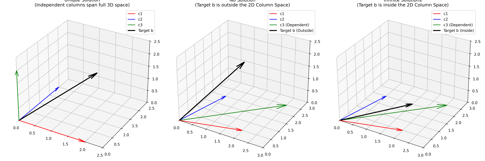

# Day 02: Gaussian Elimination, Fundamental Matrices, and Column Space

## 1. The Gaussian Elimination Process ($Ax = b$)

Gaussian Elimination is the algebraic "engine" used to solve the linear system $Ax = b$. Instead of just looking at the matrix $A$, we apply operations to both $A$ and the target vector $b$ to transform the system into an **Upper Triangular form ($Ux = c$)**.

### 1.1 Step-by-Step Numerical Example

Let's solve the system $Ax = b$ where:

$$
A = \begin{bmatrix} 2 & 1 & 1 \\ 4 & -6 & 0 \\ -2 & 7 & 2 \end{bmatrix}, \quad b = \begin{bmatrix} 5 \\ -2 \\ 9 \end{bmatrix}
$$

**Step 1: Eliminate elements below the first pivot ($A_{11} = 2$).**

* To eliminate the 4 in Row 2, we subtract 2 times Row 1 from Row 2 ($R_2 \leftarrow R_2 - 2R_1$).
    * Row 2 of $A$ becomes: $[4 - 2(2), -6 - 2(1), 0 - 2(1)] = [0, -8, -2]$.
    * $b_2$ becomes: $-2 - 2(5) = -12$.
* To eliminate the -2 in Row 3, we add Row 1 to Row 3 ($R_3 \leftarrow R_3 + R_1$).
    * Row 3 of $A$ becomes: $[-2 + 2, 7 + 1, 2 + 1] = [0, 8, 3]$.
    * $b_3$ becomes: $9 + 5 = 14$.

$$
\begin{bmatrix} 2 & 1 & 1 \\ 0 & -8 & -2 \\ 0 & 8 & 3 \end{bmatrix} \begin{bmatrix} x \\ y \\ z \end{bmatrix} = \begin{bmatrix} 5 \\ -12 \\ 14 \end{bmatrix}
$$

**Step 2: Eliminate elements below the second pivot ($A_{22} = -8$).**

* To eliminate the 8 in Row 3, we add Row 2 to Row 3 ($R_3 \leftarrow R_3 + R_2$).
    * Row 3 of $A$ becomes: $[0 + 0, 8 + (-8), 3 + (-2)] = [0, 0, 1]$.
    * $b_3$ becomes: $14 + (-12) = 2$.

$$
\begin{bmatrix} 2 & 1 & 1 \\ 0 & -8 & -2 \\ 0 & 0 & 1 \end{bmatrix} \begin{bmatrix} x \\ y \\ z \end{bmatrix} = \begin{bmatrix} 5 \\ -12 \\ 2 \end{bmatrix}
$$

**Step 3: Back-substitution to find the solution.**

Now that we have the Upper Triangular Matrix $U$, we solve from the bottom up:
1.  From $R_3$: $1z = 2 \implies \mathbf{z = 2}$.
2.  From $R_2$: $-8y - 2(z) = -12 \implies -8y - 4 = -12 \implies -8y = -8 \implies \mathbf{y = 1}$.
3.  From $R_1$: $2x + 1(y) + 1(z) = 5 \implies 2x + 1 + 2 = 5 \implies 2x = 2 \implies \mathbf{x = 1}$.

The final state vector is $\mathbf{x} = [1, 1, 2]^T$.

---

## 2. Row Operations as Matrix Multiplication

Every step in elimination is actually a matrix multiplication. If we subtract 2 times Row 1 from Row 2, we are multiplying $A$ by an **Elementary Matrix ($E_{21}$)**. 

To create $E_{21}$, start with the Identity matrix and put the multiplier (with a negative sign) in the target position:

$$
E_{21} = \begin{bmatrix} 1 & 0 & 0 \\ \mathbf{-2} & 1 & 0 \\ 0 & 0 & 1 \end{bmatrix}
$$

Applying all steps as matrices:
$$
E_{32} (E_{31} E_{21}) A = U
$$

In robotics, this is critical because we often represent motion as a sequence of matrix multiplications. Solving equations is just a special case of this transformation.

---

## 3. Fundamental Matrices in Robotics

### 3.1 Identity Matrix ($I$)
The $I$ matrix is the "1" of linear algebra. It represents "no change."
$$
I = \begin{bmatrix} 1 & 0 & 0 \\ 0 & 1 & 0 \\ 0 & 0 & 1 \end{bmatrix} \implies IA = A
$$

### 3.2 Permutation Matrix ($P$)
If a pivot is $0$, we must swap rows. $P$ is an Identity matrix with reordered rows. To swap Row 1 and Row 2:
$$
P_{12} = \begin{bmatrix} 0 & 1 & 0 \\ 1 & 0 & 0 \\ 0 & 0 & 1 \end{bmatrix} \implies P_{12} \begin{bmatrix} \text{Row 1} \\ \text{Row 2} \\ \text{Row 3} \end{bmatrix} = \begin{bmatrix} \text{Row 2} \\ \text{Row 1} \\ \text{Row 3} \end{bmatrix}
$$

### 3.3 Matrix Transpose ($A^T$)
The transpose flips the matrix over its diagonal ($A_{ij}$ becomes $A_{ji}$).
$$
A = \begin{bmatrix} 1 & 2 \\ 3 & 4 \end{bmatrix} \implies A^T = \begin{bmatrix} 1 & 3 \\ 2 & 4 \end{bmatrix}
$$
**Robotics Insight:** For rotation matrices $R$, the transpose $R^T$ is exactly the inverse $R^{-1}$ (the reverse rotation).

### 3.4 Matrix Inverse ($A^{-1}$)
The inverse "undoes" the matrix. If $Ax = b$, then $x = A^{-1}b$.
$$
A = \begin{bmatrix} 2 & 0 \\ 0 & 1 \end{bmatrix} \implies A^{-1} = \begin{bmatrix} 0.5 & 0 \\ 0 & 1 \end{bmatrix} \quad (\text{Since } A A^{-1} = I)
$$

---

## 4. Success and Failure: The Geometry of Column Space

A robot's configuration is valid only if the target motion $b$ is reachable by its actuators (the columns of $A$).



1.  **Unique Solution:** The columns $c_1, c_2, c_3$ are independent. They span all of 3D space. **Any** target $b$ can be reached.
2.  **No Solution:** The columns are dependent (e.g., $c_3 = c_1 + c_2$). They span only a **2D plane**. If the target $b$ is outside this plane, the robot cannot reach it.
3.  **Infinite Solutions:** The columns span a 2D plane, and $b$ happens to be inside that plane. There are many ways to reach the same point.

---

## 5. Quick Quiz

1.  **Inference:** If a 3x3 matrix has only two non-zero pivots after elimination, what is the dimension of its Column Space?
2.  **Matrix Logic:** If $E_{21}$ subtracts 2 times Row 1 from Row 2, what does the inverse matrix $E_{21}^{-1}$ look like? (Hint: It should add 2 times Row 1 back).
3.  **Robotics:** Why do we say a robot is "Singular" when its Jacobian matrix loses a pivot during elimination?

---

## 6. References

- **MIT 18.06 Linear Algebra** (Prof. Gilbert Strang), Lecture 03.
- **UMich ROB 501: Mathematics for Robotics**, Matrix Algebra & Systems of Equations.
- **Open Tutorial Project**: Linear Algebra for Robotics.

---

## 7. Python Implementation

```python
import numpy as np

# Define A and b from the numerical example
A = np.array([[2, 1, 1], 
              [4, -6, 0], 
              [-2, 7, 2]], dtype=float)
b = np.array([5, -2, 9])

# 1. Solving Ax = b directly
x = np.linalg.solve(A, b)
print(f"Computed Solution x: {x}")

# 2. Creating a Permutation Matrix to swap Row 1 and Row 2
P = np.array([[0, 1, 0],
              [1, 0, 0],
              [0, 0, 1]])
print("\nSwapped Matrix A (P*A):")
print(P @ A)

# 3. Computing the Transpose
print("\nTranspose of A:")
print(A.T)

# 4. Checking if Matrix is Singular (failure case)
A_singular = np.array([[1, 1, 1], [2, 2, 2], [0, 1, 0]])
rank = np.linalg.matrix_rank(A_singular)
if rank < 3:
    print("\nWarning: Matrix is singular. It only spans a 2D space!")
```