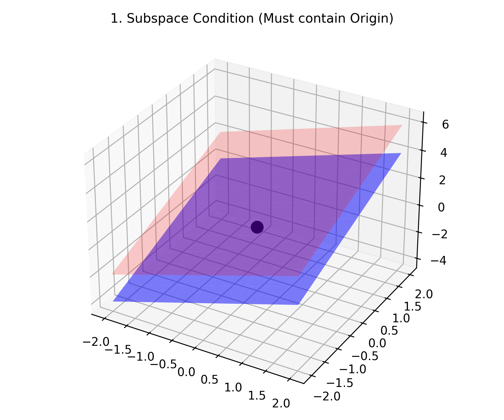
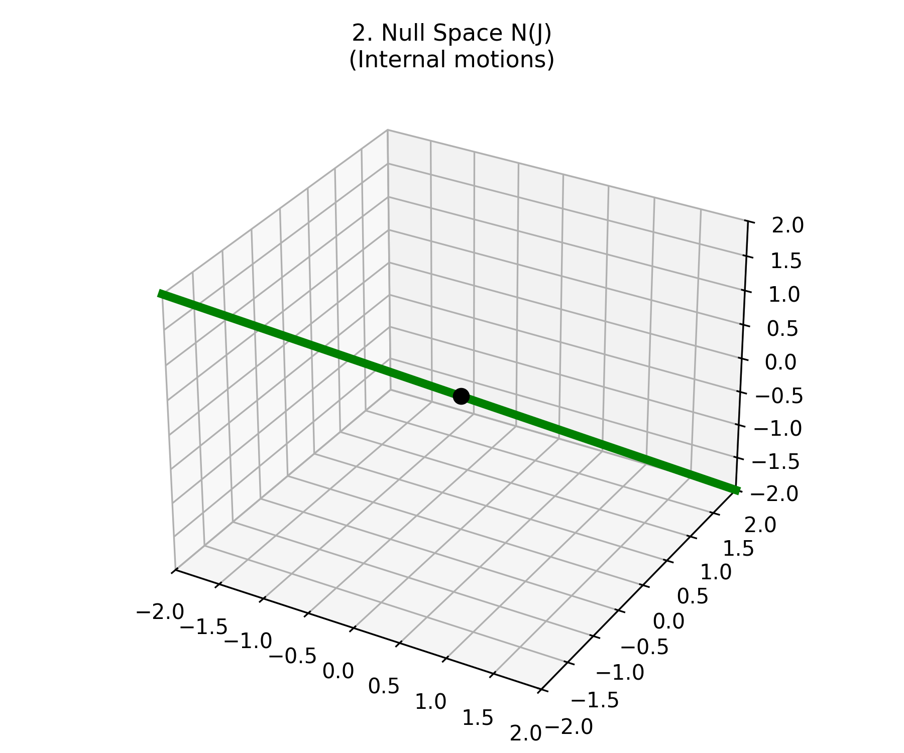
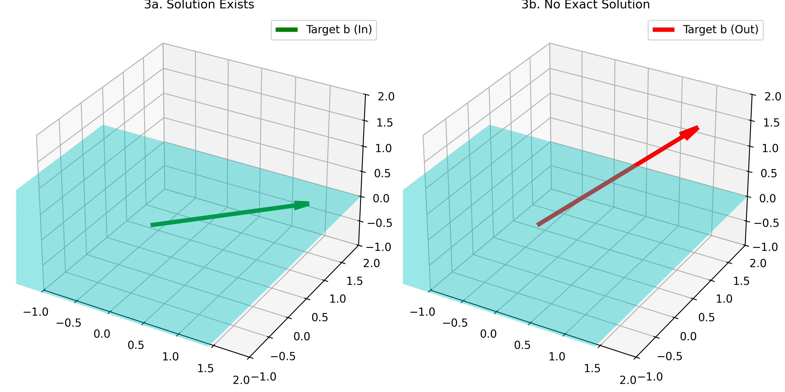
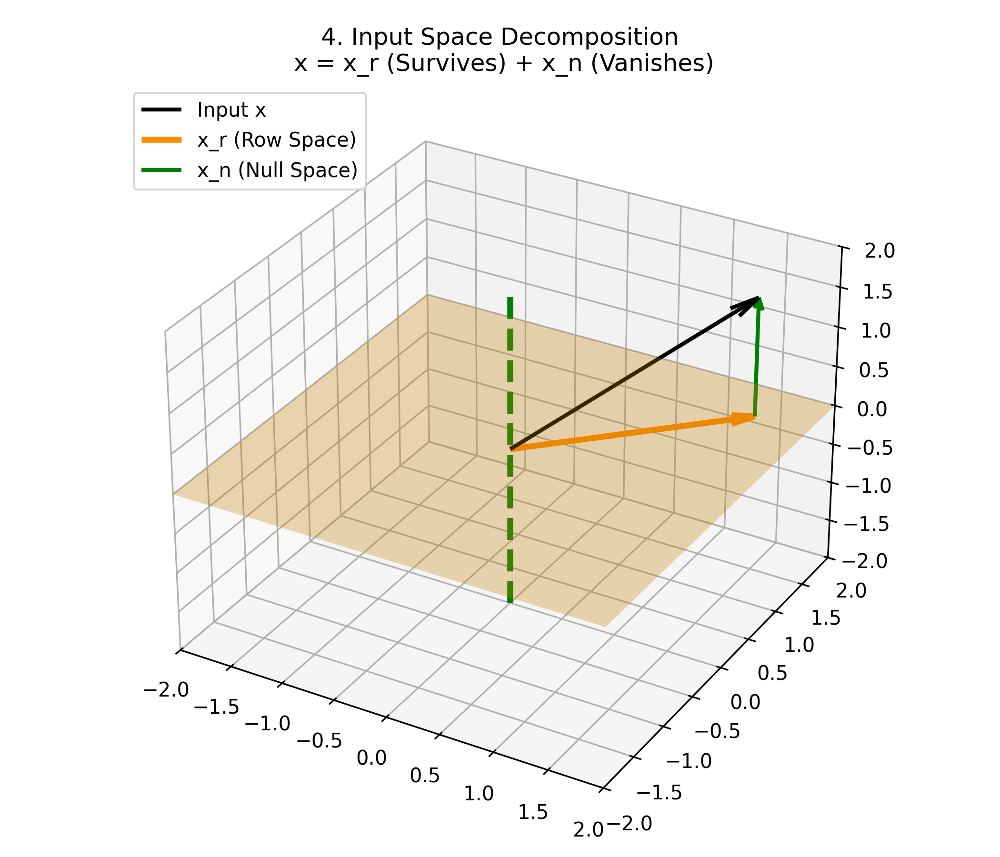
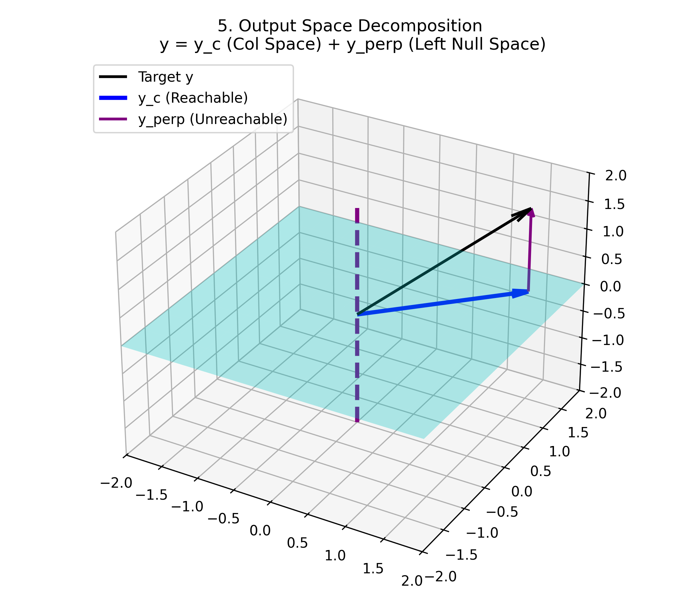

# Day 03: The Four Fundamental Subspaces and the Complete Solution

## 1. The Foundation: Vector Spaces

In robotics, we describe everything—positions, velocities, torques—using vectors. A **Vector Space** (denoted typically by $V$ or $\mathbb{R}^n$) is a collection of vectors where two fundamental operations are legally defined and safe to perform: **Vector Addition** and **Scalar Multiplication**. 

To be a formal Vector Space, the set must satisfy **4 Axioms**:

1.  **Commutativity:** $x + y = y + x$

2.  **Associativity:** $(x + y) + z = x + (y + z)$

3.  **Zero Vector:** There exists a vector $0$ such that $x + 0 = x$.

4.  **Closure:** If you add any two vectors in the space, or scale one by any real number, the result **must** remain inside that same space. It cannot escape.

---

## 2. Subspaces: Spaces within Spaces

A **Subspace** is a smaller vector space that sits perfectly inside a larger one. For a specific set of vectors to qualify as a valid subspace, it must pass a strict three-part test:

1.  **Contains the Origin:** It must include the zero vector ($0$).

2.  **Closed under Addition:** If $v$ and $w$ are in the subspace, $v + w$ must also be in the subspace.

3.  **Closed under Scalar Multiplication:** If $v$ is in the subspace, any scalar multiple $cv$ must also be in the subspace.



---

## 3. Kinematics: Motion Subspaces ($J \dot{q} = \dot{x}$)

Every matrix $A$ (or Jacobian $J$) creates fundamental subspaces. The first two deal with **Motion** (Kinematics) and live in the equation $\dot{x} = J \dot{q}$.

### 3.1 The Null Space ($N(J)$): Internal Self-Motion
The **Null Space** is the set of all input vectors that are completely "crushed" into the zero vector.

$$
J \dot{q} = 0
$$

**Robotics Meaning:** This represents pure **Internal Motion**. The robot actively moves its joints, but the end-effector stays perfectly "locked" at the origin. This redundancy is crucial for avoiding obstacles.



### 3.2 The Column Space ($C(J)$): The Reachable Workspace

The **Column Space** is the set of all possible linear combinations of its column vectors.
In robotics, the Column Space represents the **"Reachable Velocity Space"**. It mathematically defines every single direction the robot's end-effector is physically capable of moving in its current posture.

---

## 4. Existence of Solutions ($Ax = b$)

The most powerful application of the Column Space is determining if a system of equations $Ax = b$ can actually be solved. 

**The Golden Rule:** The equation $Ax = b$ has a solution **if and only if** the target vector $b$ lies completely inside the Column Space of $A$ ($b \in C(A)$).



* **Left (Solution Exists):** The target $b$ lies on the plane. The commanded task velocity is achievable.

* **Right (No Exact Solution):** The target $b$ points away from the plane. The system has no exact solution (Singularity).

---

## 5. The Complete Solution: $x = x_p + x_n$

When a solution exists, and the matrix has a Null Space, there are **infinitely many solutions**. The complete solution is the sum of two parts:

$$
x_{complete} = x_{particular} + x_{null}
$$

1.  **$x_{particular}$:** One specific solution that satisfies $A x_p = b$ (achieves the primary task).

2.  **$x_{null}$:** Any vector from the Null Space, where $A x_n = 0$ (internal motion).

Since $A(x_p + x_n) = Ax_p + Ax_n = b + 0 = b$, adding the null space motion does not disturb the primary task. This is the mathematical foundation of **Redundant Robot Control**.

---

## 6. The Geometric Structure of the Input Space ($\mathbb{R}^n$)

Now we dive into the profound geometric symmetry of linear algebra. The Input Space (Joint Space, $\mathbb{R}^n$) is perfectly divided into two orthogonal subspaces.

### 6.1 The Row Space ($Row(A) \subseteq \mathbb{R}^n$)
The Row Space consists of all linear combinations of the rows of $A$. 
* **Geometric Core:** The Input Space is exactly the direct sum of the Row Space and the Null Space, and they are perpendicular to each other.

$$
\mathbb{R}^n = Row(A) \oplus Null(A) \quad \text{and} \quad Row(A) \perp Null(A)
$$

### 6.2 Input Vector Decomposition
Because of this orthogonality, **ANY** input vector $x$ (e.g., joint velocity) can be split perfectly into two parts:

$$
x = x_r + x_n
$$
Where $x_r \in Row(A)$ and $x_n \in Null(A)$.

When we pass this input through the matrix $A$:
$$
Ax = A(x_r + x_n) = Ax_r + Ax_n = Ax_r + 0 = Ax_r
$$

**Conclusion:** * Only the **Row Space component ($x_r$)** actually contributes to the output.
* The **Null Space component ($x_n$)** is completely annihilated.

**Robotics Interpretation:** Among all your joint velocities, only the portion that lies in the Row Space actually influences the end-effector's motion. The Null Space portion is entirely wasted regarding the task.



---

## 7. The Geometric Structure of the Output Space ($\mathbb{R}^m$)

Just as the input space is split, the Output Space (Task Space, $\mathbb{R}^m$) is also perfectly divided into two orthogonal subspaces.

### 7.1 The Left Null Space ($Null(A^T) \subseteq \mathbb{R}^m$)
The Left Null Space contains vectors $y$ such that $A^T y = 0$, which implies $y^T A = 0$. 
* **Geometric Core:** The Left Null Space is absolutely perpendicular to the Column Space.

$$
\mathbb{R}^m = Col(A) \oplus Null(A^T) \quad \text{and} \quad Col(A) \perp Null(A^T)
$$

### 7.2 Output Vector Decomposition
Any target output vector $y$ in task space can be split into:

$$
y = y_c + y_\perp
$$
Where $y_c \in Col(A)$ and $y_\perp \in Null(A^T)$.

**Conclusion:**
* $y_c$ is the **reachable portion** of your target.
* $y_\perp$ is the **absolutely unreachable portion**. No matter what input $x$ you provide, you can never generate motion in the direction of $y_\perp$.

**Robotics Interpretation:** If the robot is in a singularity, the Left Null Space suddenly appears. It represents a direction in the 3D workspace where the robot cannot exert velocity or force. 



---

## 8. Summary & Advanced Applications (SLAM & Perception)

### 8.1 Row Space vs. Left Null Space (The Core Difference)

| Feature | Row Space ($Row(A)$) | Left Null Space ($Null(A^T)$) |
| :--- | :--- | :--- |
| **Location** | Input Space ($\mathbb{R}^n$) | Output Space ($\mathbb{R}^m$) |
| **Meaning** | Input directions that actually affect the output. | Output directions that are absolutely impossible to generate. |
| **Orthogonality** | $\perp Null(A)$ | $\perp Col(A)$ |
| **Robotics** | Effective, useful joint motions. | Uncontrollable task directions (Singularities). |

* **One-Line Core:** 
* *Row space:* "The input directions that survive."
* *Left null space:* "The output directions you can never reach."

### 8.2 Application: SLAM and Perception
Instead of a Jacobian mapping velocity, imagine an **Observation Matrix $H$** that maps the true state of the world to your sensor measurements: $z = H x$.

1.  **Null Space of $H$ ($Null(H)$):** * These are the **Unobservable States**. Changes in the environment along the Null Space produce exactly zero change in your sensor readings. You are completely blind to these states. (Global translation, Scale ambiguity, ...)

2.  **Left Null Space of $H$ ($Null(H^T)$):** * These are the **Unmeasurable Directions**. Because of the physical design or limitations of your sensor structure, there are certain types of measurements the sensor can *never* produce. (Outlier detection, Failure of data association.)

Understanding these spaces allows a SLAM system to deliberately move the robot to change the matrix $H$, minimizing the Null Space and making hidden states observable!

---

## 9. References

- **MIT 18.06 Linear Algebra** (Prof. Gilbert Strang), Lecture 09 & 10.
- **Modern Robotics** (Lynch & Park), Chapter 5.

---

## 10. Python Implementation

```python
import numpy as np
from scipy.linalg import null_space

print("--- 1. Orthogonality in Input Space (R^n) ---")
# Jacobian with 3 joints, 2D task
J = np.array([[1, 2, 1],
              [0, 1, 1]], dtype=float)

# Input vector x (joint velocities)
x = np.array([3.0, 2.0, 5.0])

# Project x onto Null Space
N = null_space(J)
n_basis = N[:, 0]
n_unit = n_basis / np.linalg.norm(n_basis)
x_n = np.dot(x, n_unit) * n_unit

# Project x onto Row Space (Orthogonal complement)
x_r = x - x_n

print(f"Original Input x: {x}")
print(f"Row Space Component x_r: {np.round(x_r, 3)}")
print(f"Null Space Component x_n: {np.round(x_n, 3)}")

print(f"\nProof: J @ x   = {np.round(J @ x, 3)}")
print(f"Proof: J @ x_r = {np.round(J @ x_r, 3)} (Exactly the same!)")
print(f"Proof: J @ x_n = {np.round(J @ x_n, 3)} (Vanishes to zero!)")


print("\n--- 2. Orthogonality in Output Space (R^m) ---")
# Singular Jacobian (Col space is only X-axis)
J_singular = np.array([[1, 2, 1],
                       [0, 0, 0]], dtype=float)

# Left Null Space (Unreachable output directions)
Left_N = null_space(J_singular.T)
print(f"Left Null Space Basis:\n{Left_N}")

# Try to reach a target y = [2, 5]
y_target = np.array([2.0, 5.0])
print(f"\nTarget y: {y_target}")

# The Left Null Space here is the Y-axis [0, 1]^T
y_perp = np.array([0.0, 5.0]) # The unreachable part
y_c = np.array([2.0, 0.0])    # The reachable part (Col Space)

print(f"Reachable Col Space part (y_c): {y_c}")
print(f"Unreachable Left Null part (y_perp): {y_perp}")
print("-> The robot can only achieve y_c. The y_perp requirement is physically impossible to fulfill.")
```